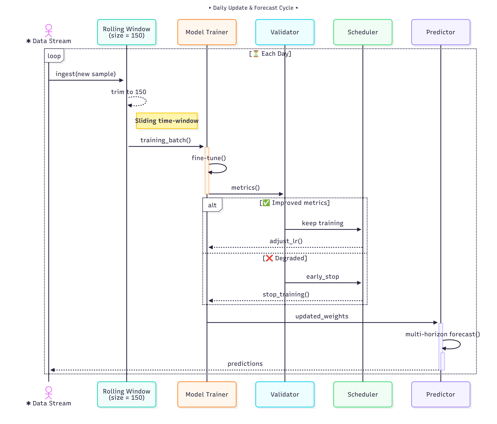
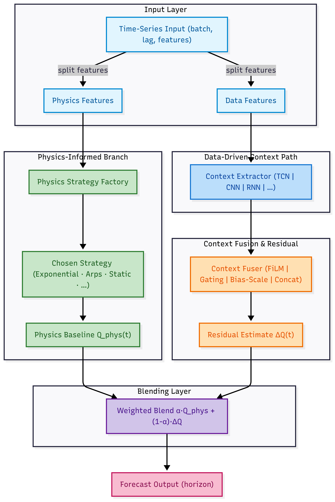
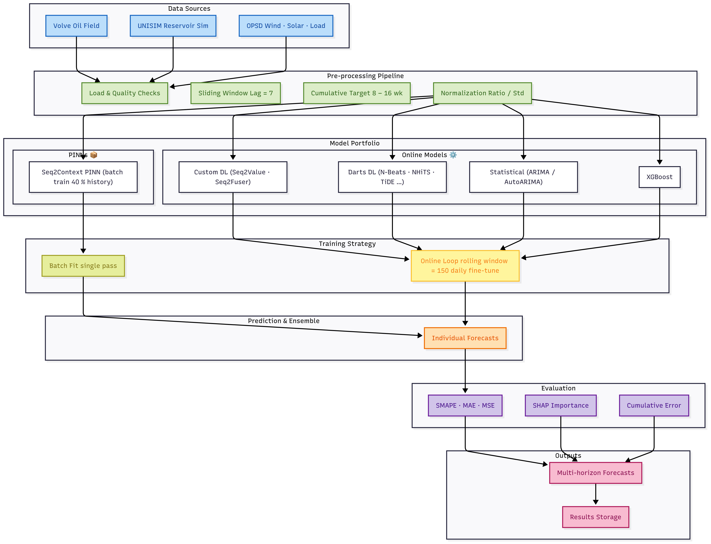
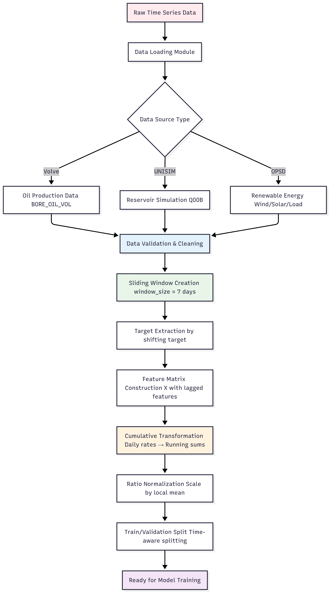

# Equinor_Forecast

**An Framework for Energy-Sector Time-Series Prediction**

Equinor_Forecast is an open-source pipeline that delivers robust medium-term cumulative forecasts (8–16 weeks) for oil, gas, and renewables. It is designed for industrial settings where historical data is often sparse and operating conditions change. The framework excels at few-shot learning, continuous adaptation, and benchmarking a wide range of forecasting models. Most industrial assets lack the long, tidy histories that conventional ML expects. Waiting years to collect data delays value creation.

## 🌐 Two Forecasting Flows

### **Flow 1 — Online Few-Shot Training**

**Use Case:** Low-latency updates, quick adaptation

📈 Uses a rolling window of 150 samples
🔁 Online fine-tuning with last 1–2 samples
🔄 Daily re-evaluation with learning rate scheduling
🧠 Compatible with XGBoost, Custom DL, ARIMA, N-Beats, etc.





### **Flow 2 — PINNs with Batch Few-Shot Training**

**Use Case:** Domain-informed long-horizon forecasts

🧪 Trained once on \~40% of data
📦 Encodes physics via exponential, Arps, pressure-based strategies
🎯 Combines deep temporal encoders with physics baselines
⚖️ Predicts production using blended residual learning





## Key Features

*   **🎯 Cumulative Forecasting:** Predicts aggregated sums (e.g., total production over 8 weeks) to smooth noise and aid strategic planning.
*   **🧩 Few-Shot Learning:** Trains effectively on as few as **150 historical samples**.
*   **📊 Comprehensive Benchmarking:** Evaluates modern (N-Beats, NHiTS, TiDE) and classic (ARIMA) models on public energy datasets.
*   **🔬 Built-in Interpretability:** Tracks feature importance over time using a longitudinal SHAP analysis.



### 📊 Datasets

| Domain              | Dataset         | Key Facts                               |
| ------------------- | --------------- | --------------------------------------- |
| Oil & gas           | **Volve**       | 4 wells, daily, target = BORE\_OIL\_VOL |
| Synthetic reservoir | **UNISIM-II-H** | 10 producers, 3 263 days, target = QOOB |
| Renewables          | **OPSD** (GB)   | Wind (30 min→1 d), Solar & Load (12 h)  |



## 🔄 Data Preparation Pipeline

The pipeline transforms heterogeneous time-series into cumulative, lagged, normalized matrices ready for training.

| Step                    | Description                                    |
| ----------------------- | ---------------------------------------------- |
| **Sliding Window**      | 7-day lag matrix built for each timestamp      |
| **Cumulative Labels**   | Daily rates → 8–16 week running sum            |
| **Ratio Normalization** | Scales by local means to prevent extrapolation |
| **Split Strategy**      | Time-aware train/validation split              |


---

## 🚀 Getting Started

### ⚖️ 1. Installation

Clone the repository and install the required dependencies.

```bash
git clone https://github.com/recod-ai/Equinor_Forecast.gitc
cd Equinor_Forecast
pip install -r requirements.txt
```

### 🧩 2. Repository Map

```text
Equinor_Forecast/
├── notebooks/
│   ├── darts/            # Darts-based experiments
│   └── forecast/         # Custom pipelines
├── src/
│   ├── forecast_pipeline # Orchestrator & configs
│   ├── data/             # Loaders & preprocessing
│   ├── models/           # ML model implementations
│   ├── evaluation/       # Metrics & analysis
│   └── statistical/      # ARIMA, AutoARIMA, etc.
├── data/                 # Raw & processed datasets
├── experiments/          # Saved configs & results
└── output_manifest/      # Generated artefacts
```

### 🧪 3. Datasets

The framework supports three primary datasets representing different aspects of energy forecasting:

#### Volve Oil Field Dataset

The Volve dataset represents real-world oil production data from Equinor's Volve oil field in the North Sea. This dataset includes production data from multiple wells with the following characteristics:

- **Wells**: 15/9-F14, 15/9-F12, 15/9-F11, and additional production wells
- **Target Variable**: BORE_OIL_VOL (oil production volume)
- **Data Location**: `data/volve/Volve_Equinor`
- **Features**: Production rates, pressure measurements, and operational parameters

#### UNISIM Reservoir Simulation Data

UNISIM provides synthetic but realistic reservoir simulation data for testing and validation of forecasting models:

- **Production Wells**: Prod-1 through Prod-10, P16 (UNISIM-IV)
- **Target Variables**: Q00B (production rate), BORE_OIL_VOL
- **Data Locations**: 
  - `data/unisim/production.c`
  - `data/UNISIM-IV-2026/Well_IV.csv`
- **Features**: Simulated production data with controlled reservoir parameters

#### Open Power System Data (OPSD)

OPSD provides renewable energy generation data for wind, solar, and load forecasting:

- **Energy Types**: Wind generation, Solar generation, Load demand
- **Target Variable**: GB_GBN_<type>_generation_actual
- **Data Location**: `data/OPSD/time_series_30`
- **Geographic Scope**: European power system data with high temporal resolution

### 📊 4. Evaluation Methodology

Model performance is evaluated using multiple metrics with particular emphasis on:

- **SMAPE (Symmetric Mean Absolute Percentage Error)** - Primary evaluation metric providing scale-independent performance assessment
- **MAE (Mean Absolute Error)** - Absolute error measurement for direct comparison
- **MSE (Mean Squared Error)** - Squared error metric emphasizing larger deviations
- **Cumulative Performance Analysis** - Long-term forecasting accuracy assessment

The evaluation framework includes comprehensive performance analysis across different datasets, wells, and forecasting horizons, with results visualized through detailed plots and statistical summaries. Model interpretability is enhanced through SHAP analysis, providing insights into feature importance and decision-making processes for improved understanding and trust in forecasting results.

### 5. 🧬 SHAP Analysis (Online only):

* Mean absolute SHAP per timestep
* Gini + Spearman metrics over time
* Beeswarm visualizations for interpretability

### 🧩 6. Algorithms & Methods

Deep Learning:

* **N-Beats, NHiTS**: Residual block architectures
* **TiDE (+ RIN)**: Long-range attention w/ stability layers
* **NLinear**: Simple but effective linear baseline

Traditional:

* **ARIMA, AutoARIMA**: Classical autoregression
* **XGBoost**: Gradient-boosted trees

PINN:

* Transformer + CNN + LSTM core
* Physics module: Exponential / Arps / Pressure
* Fused via residual weighting


### 7. 🔬 Physics-Informed Strategy Integration

The **Seq2Context** model enhances forecast accuracy by integrating **physics-informed strategies** alongside deep learning. A **factory pattern** manages these strategies, enabling flexible, modular selection based on domain knowledge and data characteristics.

#### Key Strategies:

* **Exponential Decay**
  Models natural production decline using exponential decay (`y(t) = y₀ * exp(-λt)`). Stable and interpretable; ideal for reservoir pressure depletion.

* **Arps Decline**
  Generalizes production decline via exponential, hyperbolic, or harmonic curves. Auto-selects the best fit and quantifies uncertainty.

* **Static Pressure**
  Incorporates reservoir pressure data to model the physics behind flow and depletion. Especially useful in pressure-monitored systems.

* **Weighted Ensemble**
  Learns optimal blending of multiple physics strategies, adapting to dataset characteristics for improved forecast robustness.

* **Combined Exponential-Arps**
  Hybrid approach that merges exponential and Arps behaviors to handle a wide range of production dynamics.

### 🧭 8. Online vs Batch: Trade-Offs

| Strategy   | Pros                     | Cons                    |
| ---------- | ------------------------ | ----------------------- |
| **Online** | Real-time updates, fast  | Drift-prone, local-only |
| **Batch**  | Physics + global context | Needs historical volume |

| Approach    | How It Works               | Pros                      | Cons                          |
| ----------- | -------------------------- | ------------------------- | ----------------------------- |
| Incremental | Predict `y_{t+1}` then sum | Stepwise interpretability | Error drift over time         |
| Direct      | Predict `Y_t` in one shot  | No compounding error      | Must extrapolate large values |

**Equinor\_Forecast** lets you **combine both**, choosing fit-for-purpose flow per deployment scenario.

### 🧰 10. Repository Details

The repository is organized into several key directories, each serving a specific purpose in the forecasting pipeline:

Core Directories

- **`notebooks/`** - The execution hub containing all Jupyter notebooks for experiments and analysis
  - **`darts/`** - Notebooks implementing Darts library-based forecasting models
  - **`forecast/`** - Custom forecasting implementations and experimental notebooks
- **`src/`** - Source code containing the core forecasting pipeline and utilities
  - **`forecast_pipeline/`** - Main pipeline implementation with configuration and execution logic
  - **`common/`** - Shared utilities and common functionality
  - **`data/`** - Data loading and preprocessing modules
  - **`evaluation/`** - Model evaluation and metrics calculation
  - **`models/`** - Machine learning model implementations
  - **`prediction/`** - Prediction and inference modules
  - **`statistical/`** - Statistical methods
- **`data/`** - Dataset storage and data files
- **`experiments/`** - Experimental configurations and results
- **`output_manifest/`** - Output files and result manifests

Model-Specific Directories

- **`VOLVE_MODELS/`** - Pre-trained models and configurations for Volve dataset
- **`UNISIM_MODELS/`** - Models trained on UNISIM reservoir simulation data  
- **`OPSD_MODELS/`** - Models for Open Power System Data renewable energy forecasting

### 🧠 11. Main Notebooks

The notebooks directory contains the primary execution environment for the forecasting framework:

Darts Implementation (`notebooks/darts/`)

- **`DARTS.ipynb`** - Comprehensive implementation of the Darts forecasting pipeline featuring multiple state-of-the-art models including TiDE, NLinear, N-Beats, NHiTS, and TiDE+RIN. This notebook provides an end-to-end workflow from data loading and preprocessing through model training, forecasting, and evaluation with support for multiple datasets and automated hyperparameter configuration.

- **`DARTS_Hybrid.ipynb`** - Advanced hybrid modeling approach combining multiple Darts models for improved forecasting accuracy through ensemble methods and model fusion techniques.

Custom Forecasting Implementation (`notebooks/forecast/`)

- **`base_pipeline.ipynb`** - Foundation pipeline implementation providing the core framework for custom forecasting models and experimental setups.

- **`energy_based_forecast.ipynb`** - Specialized forecasting models designed specifically for energy sector applications, incorporating domain-specific features and physics-informed modeling approaches.

- **`forecast_DL.ipynb`** - Deep learning forecasting implementations featuring custom neural network architectures optimized for time-series prediction in energy applications.

- **`forecast_XGB.ipynb`** - XGBoost-based forecasting models providing gradient boosting solutions for time-series prediction with feature engineering and hyperparameter optimization.

- **`launch_jobs_wells.ipynb`** - Automated job execution system for running forecasting experiments across multiple oil wells and production scenarios.

- **`physics_feature_analysis.ipynb`** - Analysis of physics-based features and their impact on forecasting accuracy, incorporating domain knowledge from reservoir engineering and production optimization.

- **`results_analysis.ipynb`** - Comprehensive analysis and visualization of forecasting results, including performance comparisons, error analysis, and model interpretation.

- **`run_experiments.ipynb`** - Experimental execution framework for running systematic forecasting experiments across different models, datasets, and configurations.

- **`shap.ipynb`** - Model interpretability analysis using SHAP (SHapley Additive exPlanations) values to understand feature importance and model decision-making processes.

