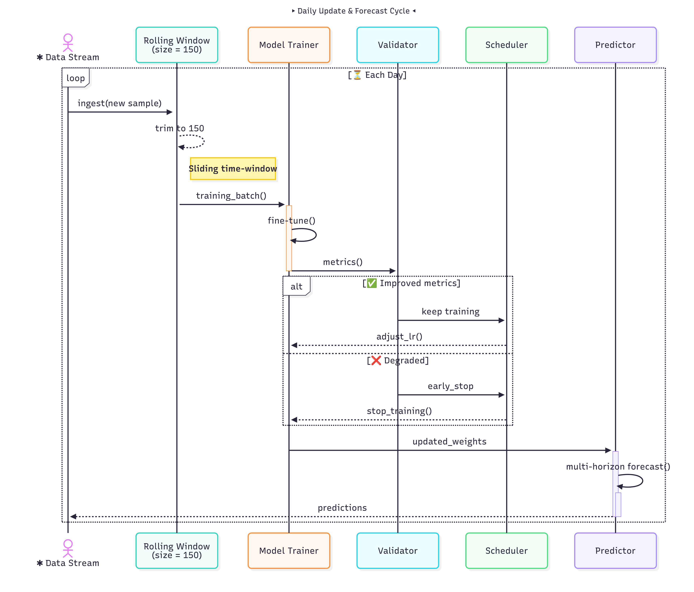
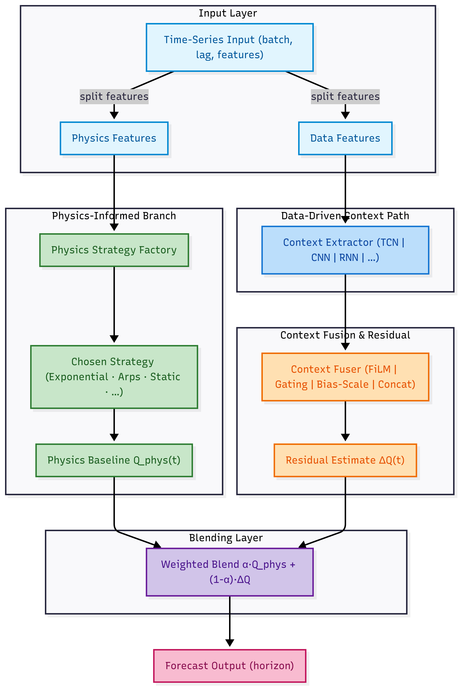
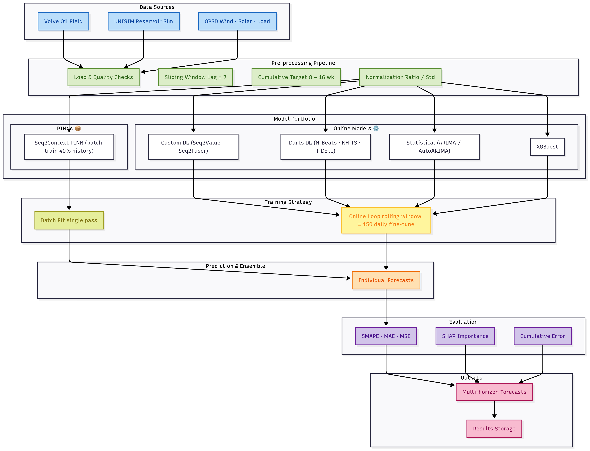
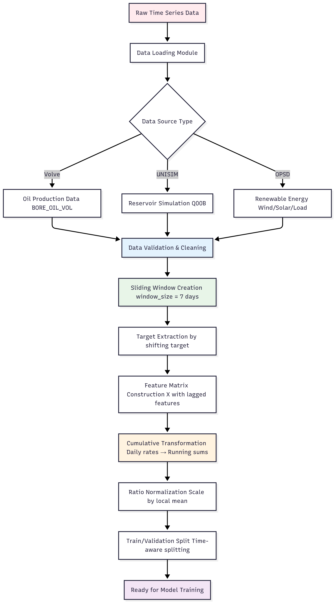

# Equinor Forecast

**An Framework for Energy-Sector Time-Series Prediction**

This repository brings together two complementary research efforts aimed at advancing time-series forecasting in the energy sector. The included tools address both the challenge of making robust predictions with limited data and the integration of domain knowledge into machine learning models. The pipeline supports cumulative forecasts for oil, gas, and renewables over medium-term horizons (8–16 weeks), and is designed for industrial settings where data is sparse and conditions evolve.

---

## Few-Shot Learning for Time-Series Forecasting

* Adapts to changing conditions with incremental, online learning
* Requires minimal historical data—ideal for real-world, data-scarce settings
* 2-shot fine-tuning with every new sample, enabling continuous model updates
* Performs strongly across oil, gas, wind, solar, and energy load datasets
* Outperforms standard models, even without complex architectures -- diverse horizons  (8–16 weeks)
* Built-in interpretability for practical industrial use

---

## Residual Physics-Informed Neural Networks (RePINN) [Under construction]

* Fuses physical decline-curve models with deep residual learning
* Supports a variety of physical strategies and neural context extractors
* Learnable fusion enables clear separation of physical and data-driven contributions
* Maintains physical plausibility while boosting forecast accuracy
* Demonstrates superior performance on production data
* Enhances transparency and adaptability for critical energy-sector applications

## Project Overview

The Equinor Forecast Project represents a comprehensive data science initiative focused on developing sophisticated time series forecasting workflows using the Darts library and advanced machine learning pipelines. This repository serves as a bridge between theoretical forecasting concepts and practical implementation, providing researchers and practitioners with a complete toolkit for building, evaluating, and deploying forecasting models across diverse industrial datasets.

The project encompasses two primary domains of expertise: foundational time series modeling using the Darts library, and production-ready forecasting pipelines that incorporate adaptive learning, online training, and real-time prediction capabilities. The repository is structured to facilitate both educational exploration and industrial application, making it suitable for academic research, commercial deployment, and hybrid use cases.

At its core, the project addresses the critical challenge of forecasting in dynamic environments where traditional static models fail to capture evolving patterns and changing system dynamics. Through the implementation of sliding window fine-tuning, incremental learning algorithms, and sophisticated post-processing techniques, the project delivers forecasting solutions that adapt continuously to new data while maintaining computational efficiency and prediction accuracy.

The repository integrates multiple datasets from the energy sector, including offshore oil production data from the Volve field, reservoir simulation outputs from UNISIM models, and European energy generation data from the Open Power System Data (OPSD) initiative. This diverse dataset collection enables comprehensive evaluation of forecasting methodologies across different temporal scales, data characteristics, and industrial contexts.

## Notebooks

This directory is the central hub for all forecasting experiments, divided into two core methodologies. Each notebook contains detailed Markdown cells explaining its internal steps, and each subdirectory has a dedicated `README.md` for a deeper overview of its specific pipeline.

---

### 📄 Online Learning & Adaptive Forecasting

This pipeline focuses on models that are continuously fine-tuned on new data using a sliding window, simulating real-world adaptive learning scenarios.

*   #### [**`forecast_DL.ipynb`**](https://github.com/recod-ai/Equinor_Forecast/blob/main/notebooks/forecast/forecast_DL.ipynb)
    Drives the online training loop for **Deep Learning models** (Keras/TensorFlow). It automates the entire process of initial training, iterative fine-tuning on a sliding window, and parallel prediction across multiple time series.

*   #### [**`forecast_XGB.ipynb`**](https://github.com/recod-ai/Equinor_Forecast/blob/main/notebooks/forecast/forecast_XGB.ipynb)
    Applies the same adaptive learning methodology using **Extreme Gradient Boosting (XGBoost)**. It handles sequential fine-tuning and prediction, demonstrating the flexibility of the online training architecture.

*   #### 📖 **[Online Forecasting README](https://github.com/recod-ai/Equinor_Forecast/blob/main/notebooks/forecast/README.md)**
    For a comprehensive overview of this methodology, its architecture, and how the models adapt over time, please refer to this main README file.

---

### 📊 Darts Hyperparameter Sensitivity Analysis

This pipeline is designed to conduct a large-scale, fair comparison of multiple forecasting models by evaluating them across a wide range of hyperparameter configurations.

*   #### 🚀 [**`run_all_experiments_DARTS.ipynb`**](https://github.com/recod-ai/Equinor_Forecast/blob/main/notebooks/darts/run_all_experiments_DARTS.ipynb)
    **The Orchestrator.** This is the primary entry point for executing the entire sensitivity analysis. It automates the process by reading `config.py`, generating a job for each `(model, configuration)` pair, and running them in parallel via `papermill`. It is designed for large-scale, reproducible experimentation.

*   #### 📈 [**`analyze_results.ipynb`**](https://github.com/recod-ai/Equinor_Forecast/blob/main/notebooks/darts/analyze_results.ipynb)
    **The Report Generator.** This notebook is the final step in the analysis. It automatically scans the `papermill_outputs` directory, loads all individual result CSVs, and performs a systematic analysis to identify the best-performing configuration for each algorithm. Its final output is the set of clean, paper-ready tables.

*   #### 📖 **[Darts Sensitivity Analysis README](https://github.com/recod-ai/Equinor_Forecast/tree/main/notebooks/darts)**
    For a complete guide on the experimental design, the configuration profiles tested, and the parallel execution workflow, see this main README file.

<sub>Note: The plots and results were omitted, as Git does not allow files larger than 50 MB. All experiments can be easily reproduced by cloning this directory and running the provided notebooks and scripts.</sub>

---

## 🌐 Two Forecasting Flows

### **Flow 1 — Online Few-Shot Training**

**Use Case:** Low-latency updates, quick adaptation

📈 Uses a rolling window of 150 samples
🔁 Online fine-tuning with last 1–2 samples
🔄 Daily re-evaluation with learning rate scheduling
🧠 Compatible with XGBoost, Custom DL, ARIMA, N-Beats, etc.





### **Flow 2 — PINNs with Batch Few-Shot Training**

**Use Case:** Domain-informed long-horizon forecasts

🧪 Trained once on \~40% of data
📦 Encodes physics via exponential, Arps, pressure-based strategies
🎯 Combines deep temporal encoders with physics baselines
⚖️ Predicts production using blended residual learning





## Key Features

*   **🎯 Cumulative Forecasting:** Predicts aggregated sums (e.g., total production over 8 weeks) to smooth noise and aid strategic planning.
*   **🧩 Few-Shot Learning:** Trains effectively on as few as **150 historical samples**.
*   **📊 Comprehensive Benchmarking:** Evaluates modern (N-Beats, NHiTS, TiDE) and classic (ARIMA) models on public energy datasets.
*   **🔬 Built-in Interpretability:** Tracks feature importance over time using a longitudinal SHAP analysis.



### 📊 Datasets

| Domain              | Dataset         | Key Facts                               |
| ------------------- | --------------- | --------------------------------------- |
| Oil & gas           | **Volve**       | 4 wells, daily, target = BORE\_OIL\_VOL |
| Synthetic reservoir | **UNISIM-II-H** | 10 producers, 3 263 days, target = QOOB |
| Renewables          | **OPSD** (GB)   | Wind (30 min→1 d), Solar & Load (12 h)  |



## 🔄 Data Preparation Pipeline

The pipeline transforms heterogeneous time-series into cumulative, lagged, normalized matrices ready for training.

| Step                    | Description                                    |
| ----------------------- | ---------------------------------------------- |
| **Sliding Window**      | 7-day lag matrix built for each timestamp      |
| **Cumulative Labels**   | Daily rates → 8–16 week running sum            |
| **Ratio Normalization** | Scales by local means to prevent extrapolation |
| **Split Strategy**      | Time-aware train/validation split              |


---

## 🚀 Getting Started

### ⚖️ 1. Installation

Clone the repository and install the required dependencies.

```bash
git clone https://github.com/recod-ai/Equinor_Forecast.gitc
cd Equinor_Forecast
pip install -r requirements.txt
```

### 🧩 2. Repository Map

The Equinor Forecast repository is meticulously organized to provide a clear and logical structure for all project components. This hierarchical arrangement facilitates navigation, understanding, and collaboration, ensuring that users can easily locate relevant files and comprehend their interdependencies. The repository is divided into several key directories, each serving a specific purpose within the overall forecasting framework.

```
.
├── README.md              # Top-level overview and orchestration
├── notebooks/
│   ├── darts/             # Darts-specific modeling notebooks
│   │   └── README.md      # Detailed documentation for Darts notebooks
│   │   └── DARTS.ipynb    # Introduction to Darts library and basic models
│   │   └── DARTS_Hybrid.ipynb # Demonstrates hybrid forecasting models with Darts
│   │   └── run_all_experiments_DARTS.ipynb # Script to run all Darts experiments
│   └── forecast/          # Overall forecasting workflows and analysis
│       └── README.md      # Explanation of forecasting pipelines and usage
│       └── base_pipeline.ipynb # Core pipeline structure and common functionalities
│       └── forecast_DL.ipynb # Deep Learning-based forecasting pipeline
│       └── forecast_XGB.ipynb # XGBoost-based forecasting pipeline
│       └── main_forecast_analysis.ipynb # Notebook for analyzing forecast results
│       └── main_forecast_pipeline.ipynb # Main notebook to run the forecasting pipeline
│       └── ... (other supporting notebooks and directories)
├── data/                  # Contains raw and processed data files
├── src/                   # Source code for custom modules and utilities
├── models/                # Directory for saving trained models
├── evaluation/            # Scripts for model evaluation and metrics
├── training/              # Scripts for model training and fine-tuning
├── utils/                 # General utility functions
```

### `notebooks/` Directory

The `notebooks/` directory is the central hub for all Jupyter notebooks developed within the project. It is further subdivided into two main categories: `darts/` and `forecast/`, each dedicated to a distinct aspect of the forecasting workflow. This separation ensures clarity and modularity, enabling users to focus on specific areas of interest without being overwhelmed by the entire codebase.

#### `notebooks/darts/`

This subdirectory is dedicated to notebooks that explore and implement time series forecasting models using the Darts library. Darts is a Python library for easy manipulation and forecasting of time series, offering a wide range of models from traditional statistical methods to deep learning approaches. The notebooks in this directory are designed to provide hands-on experience with Darts, covering fundamental concepts, model selection, training, and evaluation.

- **`README.md`**: This README provides detailed documentation specific to the Darts notebooks. It explains the purpose of each notebook, the Darts models demonstrated, and any specific prerequisites or configurations required to run them. It serves as a comprehensive guide for users interested in leveraging Darts for their forecasting tasks.

- **`DARTS.ipynb`**: This notebook serves as an introduction to the Darts library. It covers basic functionalities such as data loading, time series creation, and the application of simple Darts models like ARIMA. It's an ideal starting point for users new to Darts or time series forecasting in general.

- **`run_all_experiments_DARTS.ipynb`**: This notebook is designed to automate the execution of various Darts experiments. It provides a structured way to run multiple models, evaluate their performance, and compare results. This is particularly useful for systematic model benchmarking and hyperparameter tuning within the Darts framework.

#### `notebooks/forecast/`

This subdirectory contains notebooks that demonstrate end-to-end forecasting workflows, encompassing data loading, preprocessing, model training, and output interpretation. These notebooks focus on building robust and adaptive forecasting pipelines that can handle real-world complexities, including incremental learning and parallel processing. The emphasis here is on operationalizing forecasting models for continuous deployment and performance monitoring.

- **`README.md`**: This README provides an in-depth explanation of the forecasting pipelines implemented in this directory. It details the architecture, key components, and the underlying principles of adaptive learning and online training. It also includes instructions on how to configure and run the various forecasting workflows.

- **`forecast_DL.ipynb`**: This notebook implements a deep learning-based forecasting pipeline. It showcases how neural networks can be integrated into an adaptive learning framework for time series prediction. It covers aspects such as model architecture, training strategies, and the use of deep learning frameworks like TensorFlow/Keras.

- **`forecast_XGB.ipynb`**: This notebook focuses on an XGBoost-based forecasting pipeline. XGBoost, a powerful gradient boosting framework, is applied within the adaptive learning paradigm. This notebook demonstrates its effectiveness in handling complex time series data and achieving high prediction accuracy.

### 🧪 3. Datasets

The framework supports three primary datasets representing different aspects of energy forecasting:

#### Volve Oil Field Dataset

The Volve dataset represents real-world oil production data from Equinor's Volve oil field in the North Sea. This dataset includes production data from multiple wells with the following characteristics:

- **Wells**: 15/9-F14, 15/9-F12, 15/9-F11, and additional production wells
- **Target Variable**: BORE_OIL_VOL (oil production volume)
- **Data Location**: `data/volve/Volve_Equinor`
- **Features**: Production rates, pressure measurements, and operational parameters

#### UNISIM Reservoir Simulation Data

UNISIM provides synthetic but realistic reservoir simulation data for testing and validation of forecasting models:

- **Production Wells**: Prod-1 through Prod-10, P16 (UNISIM-IV)
- **Target Variables**: Q00B (production rate), BORE_OIL_VOL
- **Data Locations**: 
  - `data/unisim/production.c`
  - `data/UNISIM-IV-2026/Well_IV.csv`
- **Features**: Simulated production data with controlled reservoir parameters

#### Open Power System Data (OPSD)

OPSD provides renewable energy generation data for wind, solar, and load forecasting:

- **Energy Types**: Wind generation, Solar generation, Load demand
- **Target Variable**: GB_GBN_<type>_generation_actual
- **Data Location**: `data/OPSD/time_series_30`
- **Geographic Scope**: European power system data with high temporal resolution

### 📊 4. Evaluation Methodology

Model performance is evaluated using multiple metrics with particular emphasis on:

- **SMAPE (Symmetric Mean Absolute Percentage Error)** - Primary evaluation metric providing scale-independent performance assessment
- **MAE (Mean Absolute Error)** - Absolute error measurement for direct comparison
- **MSE (Mean Squared Error)** - Squared error metric emphasizing larger deviations
- **Cumulative Performance Analysis** - Long-term forecasting accuracy assessment

The evaluation framework includes comprehensive performance analysis across different datasets, wells, and forecasting horizons, with results visualized through detailed plots and statistical summaries. Model interpretability is enhanced through SHAP analysis, providing insights into feature importance and decision-making processes for improved understanding and trust in forecasting results.

### 5. 🧬 SHAP Analysis (Online only):

* Mean absolute SHAP per timestep
* Gini + Spearman metrics over time
* Beeswarm visualizations for interpretability

### 🧩 6. Algorithms & Methods

Deep Learning:

* **N-Beats, NHiTS**: Residual block architectures
* **TiDE (+ RIN)**: Long-range attention w/ stability layers
* **NLinear**: Simple but effective linear baseline

Traditional:

* **ARIMA, AutoARIMA**: Classical autoregression
* **XGBoost**: Gradient-boosted trees

PINN:

* Transformer + CNN + LSTM core
* Physics module: Exponential / Arps / Pressure
* Fused via residual weighting


### 7. 🔬 Physics-Informed Strategy Integration

The **Seq2Context** model enhances forecast accuracy by integrating **physics-informed strategies** alongside deep learning. A **factory pattern** manages these strategies, enabling flexible, modular selection based on domain knowledge and data characteristics.

#### Key Strategies:

* **Exponential Decay**
  Models natural production decline using exponential decay (`y(t) = y₀ * exp(-λt)`). Stable and interpretable; ideal for reservoir pressure depletion.

* **Arps Decline**
  Generalizes production decline via exponential, hyperbolic, or harmonic curves. Auto-selects the best fit and quantifies uncertainty.

* **Static Pressure**
  Incorporates reservoir pressure data to model the physics behind flow and depletion. Especially useful in pressure-monitored systems.

* **Weighted Ensemble**
  Learns optimal blending of multiple physics strategies, adapting to dataset characteristics for improved forecast robustness.

* **Combined Exponential-Arps**
  Hybrid approach that merges exponential and Arps behaviors to handle a wide range of production dynamics.

### 🧭 8. Online vs Batch: Trade-Offs

| Strategy   | Pros                     | Cons                    |
| ---------- | ------------------------ | ----------------------- |
| **Online** | Real-time updates, fast  | Drift-prone, local-only |
| **Batch**  | Physics + global context | Needs historical volume |

| Approach    | How It Works               | Pros                      | Cons                          |
| ----------- | -------------------------- | ------------------------- | ----------------------------- |
| Incremental | Predict `y_{t+1}` then sum | Stepwise interpretability | Error drift over time         |
| Direct      | Predict `Y_t` in one shot  | No compounding error      | Must extrapolate large values |

**Equinor\_Forecast** lets you **combine both**, choosing fit-for-purpose flow per deployment scenario.

### 🧰 10. Repository Details

The repository is organized into several key directories, each serving a specific purpose in the forecasting pipeline:

Core Directories

- **`notebooks/`** - The execution hub containing all Jupyter notebooks for experiments and analysis
  - **`darts/`** - Notebooks implementing Darts library-based forecasting models
  - **`forecast/`** - Custom forecasting implementations and experimental notebooks
- **`src/`** - Source code containing the core forecasting pipeline and utilities
  - **`forecast_pipeline/`** - Main pipeline implementation with configuration and execution logic
  - **`common/`** - Shared utilities and common functionality
  - **`data/`** - Data loading and preprocessing modules
  - **`evaluation/`** - Model evaluation and metrics calculation
  - **`models/`** - Machine learning model implementations
  - **`prediction/`** - Prediction and inference modules
  - **`statistical/`** - Statistical methods
- **`data/`** - Dataset storage and data files
- **`experiments/`** - Experimental configurations and results
- **`output_manifest/`** - Output files and result manifests

Model-Specific Directories

- **`VOLVE_MODELS/`** - Pre-trained models and configurations for Volve dataset
- **`UNISIM_MODELS/`** - Models trained on UNISIM reservoir simulation data  
- **`OPSD_MODELS/`** - Models for Open Power System Data renewable energy forecasting

### 🧠 11. Main Notebooks

The notebooks directory contains the primary execution environment for the forecasting framework:

Darts Implementation (`notebooks/darts/`)

- **`DARTS.ipynb`** - Comprehensive implementation of the Darts forecasting pipeline featuring multiple state-of-the-art models including TiDE, NLinear, N-Beats, NHiTS, and TiDE+RIN. This notebook provides an end-to-end workflow from data loading and preprocessing through model training, forecasting, and evaluation with support for multiple datasets and automated hyperparameter configuration.

- **`DARTS_Hybrid.ipynb`** - Advanced hybrid modeling approach combining multiple Darts models for improved forecasting accuracy through ensemble methods and model fusion techniques.

Custom Forecasting Implementation (`notebooks/forecast/`)

- **`base_pipeline.ipynb`** - Foundation pipeline implementation providing the core framework for custom forecasting models and experimental setups.

- **`energy_based_forecast.ipynb`** - Specialized forecasting models designed specifically for energy sector applications, incorporating domain-specific features and physics-informed modeling approaches.

- **`forecast_DL.ipynb`** - Deep learning forecasting implementations featuring custom neural network architectures optimized for time-series prediction in energy applications.

- **`forecast_XGB.ipynb`** - XGBoost-based forecasting models providing gradient boosting solutions for time-series prediction with feature engineering and hyperparameter optimization.

- **`launch_jobs_wells.ipynb`** - Automated job execution system for running forecasting experiments across multiple oil wells and production scenarios.

- **`physics_feature_analysis.ipynb`** - Analysis of physics-based features and their impact on forecasting accuracy, incorporating domain knowledge from reservoir engineering and production optimization.

- **`results_analysis.ipynb`** - Comprehensive analysis and visualization of forecasting results, including performance comparisons, error analysis, and model interpretation.

- **`run_experiments.ipynb`** - Experimental execution framework for running systematic forecasting experiments across different models, datasets, and configurations.

- **`shap.ipynb`** - Model interpretability analysis using SHAP (SHapley Additive exPlanations) values to understand feature importance and model decision-making processes.

